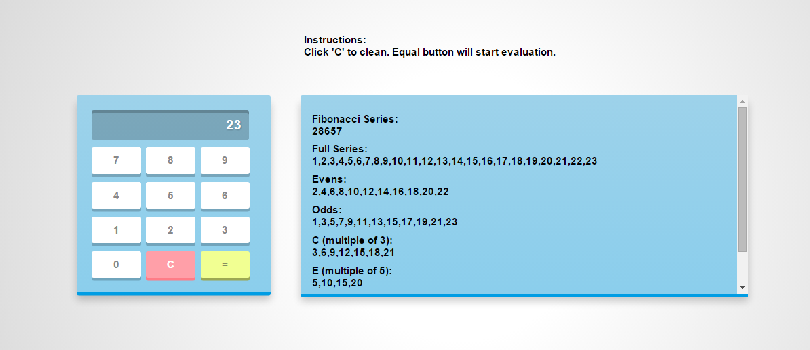
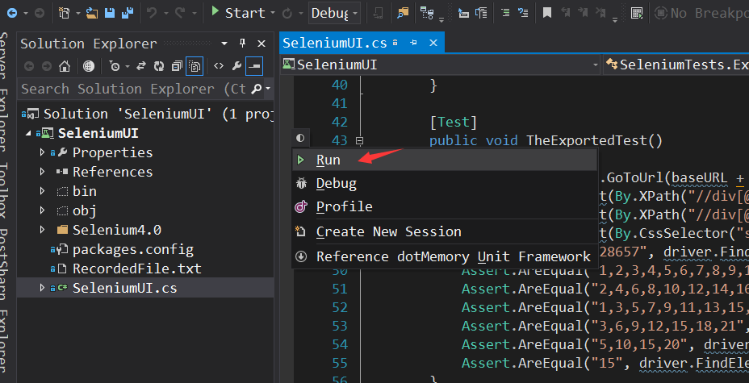
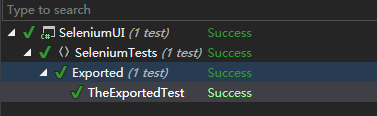

# Numeric-Sequence-Calculator
Numeric Sequence Calculator

### Folder Structure
1. *WebAPI has MVC project and Unit test*
  
2. *SeleniumUI has end-to-end UI test using Selenium. Assume user have firefox and Selenium ide plugin installed.*
Otherwise, click here inside firefox to install: http://release.seleniumhq.org/selenium-ide/2.9.0/selenium-ide-2.9.0.xpi 

### How to run test
1. Open WebAPI project, Run it. Notice the port number may vary depends on each computer. Write down PORT number.
2. Open SeleniumUI project:
  - 2.1 If your dll reference is broken, you should all all the dll again, inside "SeleniumUI\Selenium4.0" folder e.g WebDriver.dll
3. Run all the test.
4. Check result in the broswer. Green means UI test passed.
 
Run UI test in vs2013:

UI test result:

